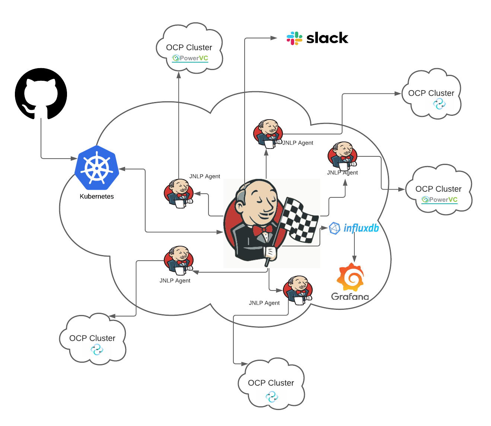
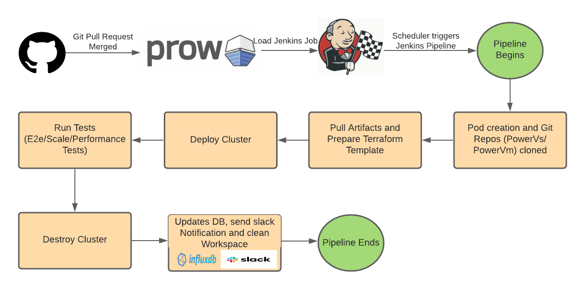

## Introduction

This project contains scripts and infra configuration files for Jenkins CD Pipelines for OpenShift on IBM Power
It includes pipelines that create openshift clusters in PowerVS and PowerVC environment

Jenkins Url: https://jenkins.ppc64le-cloud.org/

## Jenkins Architecture

### Working on Jenkins in brief
- The Jenkins is running on an IKS cluster
- Pods are created to run the JNLP agents
- The JNLP agents runs the pipelines to perform cluster creation and running tests in PowerVS and PowerVC environment

## Jenkins Pipeline flow

1) When git PR is created PROW job runs to verify the Jenkins pipeline
2) After PR gets merged PROW job runs to load the jenkins jobs.
3) The Jenkins scheduler runs jobs according to schedule mentioned in [jinja template file](hack/jjb_template.jinja2)
4) The JNLP agents are created that runs pipeline job which creates cluster, performs tests.
5) After successful cluster creation and running of tests, the test results are stored in influx db which is used for grafana dashboard creation