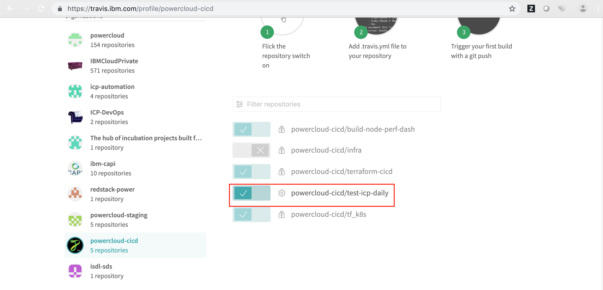

Repo for maintaining icp daily deployment on KVM PowerVM

## Load the jenkins jobs

```shell
# make load-jenkins-jobs JENKINS_USER=<jenkins user> JENKINS_PASSWORD=<jenkins password> JENKINS_URI=<>

```
                                            OR

Enable in travis. The .travis.yaml can be used for it. Go to the travis account profile identify the Org and repo and enabled it.




Go to the settings of the project and update the jenkins' information.

